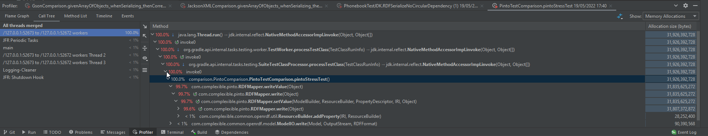

# Nem-funkcionális jellemzők vizsgálata

A csapat vizsgálta a projektet teljesítmény, stresszelhetőség, biztonság és használhatóság szempontjából Java Flight Recorder segítségével.
Az eredmények a Wiki "Nem funkcionális jellemzők vizsgálata" oldalon találhatóak.

A munkát végezték Haragos Gergő Viktor (GSON), Kalics Ádám (Pinto), Kiss Mária Dominika (Java) és Pethes Dániel Imre (Jackson).
